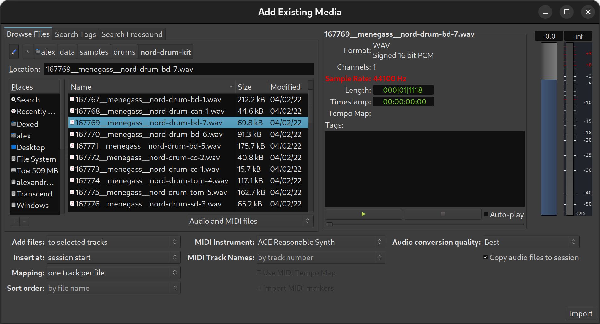
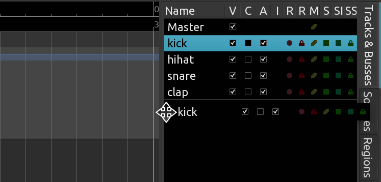

+++
title = "Arranging tracks"
chapter = false
weight = 2
+++

In the following chapters we will use Ardour to create a short rhythmic passage
using several drumkit samples.

We will continue working on this passage in later tutorials, such as _Working
with Regions_ and _Creating Looped Sections_. We assume that you have read
the chapters in the _Getting Started_ section already, and are familiar with
_Importing Audio_, _Tracks_, and the _Timeline_.

## Importing Samples

The first step is to add some sounds, which is discussed at length in the
_Importing Audio_ chapter. Here, we are using the _Add existing media_
dialog (**Ctrl + I**) to import some drumkit samples as regions. The samples
used in this tutorial were obtained from a sample pack from the
[freesound.org](http://www.freesound.org/) website (the
[Nord Drum Mini Kit](https://freesound.org/people/menegass/packs/10430/) sample
pack).

 

After importing a few sounds from the downloaded sample pack (bass drum, snare,
hi-hat, clap), our session looks like this (in this case we used the _Add files
as new tracks_ option, and inserted _at session start_. The drumkit samples
appear as new individual tracks in the _Editor_ window, each with the name of the
audio file used. If the file names are too long or obscure, you may want to
rename your tracks for clarity.

 

## Organizing the Tracks

Let's rename the tracks so we can quickly see the location of each instrument.
To do that, double-click on the track name to edit it.

 

You may also wish to rearrange the order of the tracks from top to bottom in the
editor window. Do that by clicking the _Tracks & Busses_ tab at the far right
of the _Editor_ window and drag-and-dropping the tracks in the order you want.

 

{}
You can also use the V check boxes in this tab to view or hide
tracks in the main canvas.
{}

Here we have ordered the drumkit so that the kick drum is on the bottom, the
snare and high-hat are in the middle, and the clap is on top.  

 

## Continuing

In the next step we will learn about setting up the meter to organize these
samples into a rhythm.

Next: [SETTING UP THE METER](../setting-up-the-meter)
