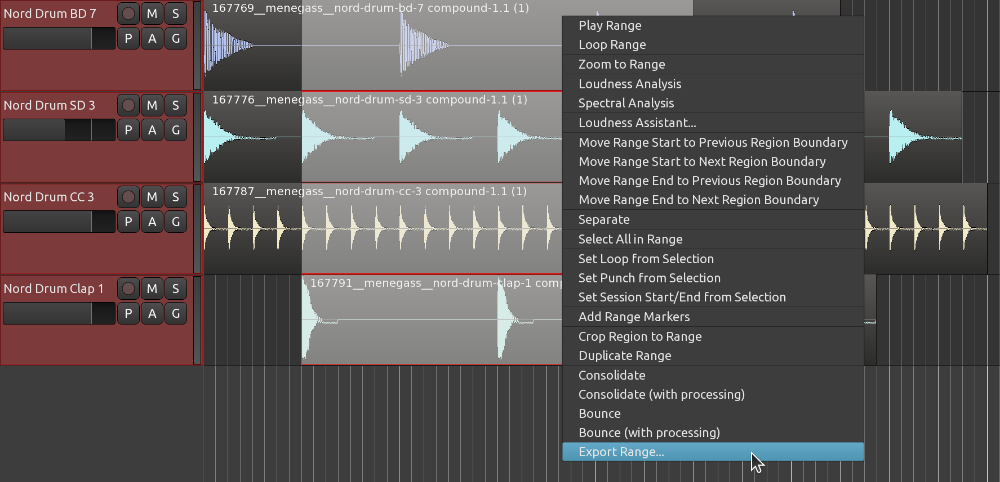

+++
title = "Exporting ranges"
chapter = false
weight = 3
+++

As you have already learned in previous chapters, exporting an isolated region
does not export all of the changes you might have made to that region. To export edits such as panning, fader automation, and plugin effects, you must
export either a range or the entire session.

## Exporting a Range

To export a range, follow these steps:

1. Click on the **Range Mode** button (**R** shortcut)

2. Make a range selection:

3. Right click on the range and choose _Export Range_ from the menu:

This will open the familiar _Export_ dialog explained in the [Exporting
Sessions](../exporting-a-session) chapter. Choose your options, if any, and
click **Export**. The range will be exported and saved as an audio file.

### What Exactly I s a Range?

To define a range is simply to specify a beginning and ending point in time. The **Selection** display to the right of the secondary clock shows the start and end times of the selected range, as well as its duration.



The range created through the method above will disappear as soon as you click outside of it.

The _Export Range_ command will export everything that plays through the
_Master_ bus, exactly as it plays back in your session. If any of the tracks
have the **Mute** or **Solo** buttons engaged, this will also affect which
tracks are heard in the exported file.

### How to Create a Range Marker and Then Re-select a Range

Range markers are essentially two location markers the are grouped together to mark the beginning and end of a section on the timeline. Range markers look like this:



You can use range markers to "bookmark" one or more ranges that you need to remember or use again later. Here is how you can do that.

1. Make a range selection either in _Range_ mode or in _Grab_ mode with _Smart_
option enabled.

2. Create range markers in one of the following ways:

* Right-click on a range selection and choose _Add Range Marker_.
* From the timeline, right click on the _Range Markers_ horizontal space and choose _New Range_.
* From one or more selected regions, right-click on the region and choose _Add
Single Range Marker_ (if a single region is selected), or _Add Range Marker Per
Region_ (if multiple regions are selected).

3. Click anywhere outside the range selection to lose it.

4. Right-click on either of the two range selection markers on the timeline and
choose the _Select Range_ menu option. The range selection will be restored.

{}
You can clear all existing range markers by right-clicking on the _Range Markers_ area of the timeline and choosing _Clear All Ranges_.
{}

## Continuing 

You now know how to Export isolated Regions, selected Ranges from your Session, or the entire Session as a Stereo Mix. The last section of this tutorial explains saving sessions, snapshots, and templates.

Next: [SAVING A SESSION](../../saving-sessions/saving-a-session/)
