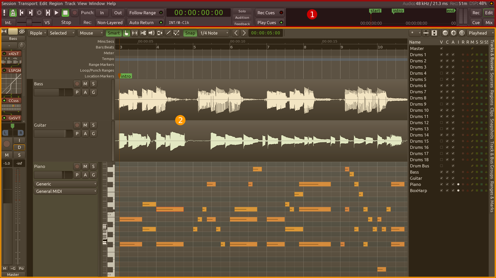

+++
title = "Vue d'ensemble de l'interface"
description = "Bases de l'interface utilisateur d'Ardour"
weight = 2
+++

Cette section vous donnera un aperçu de base de l'interface utilisateur d'Ardour.

Nous examinerons les éléments communs de l'interface, les fenêtres principales et nous nous concentrerons sur les fenêtres _Editor_ et _Mixer_. Les chapitres suivants donneront des informations plus détaillées sur chacune des fonctionnalités énumérées ici.

## Fenêtre d'Ardour

Voici une vue typique d'un projet ouvert dans Ardour :

L'interface utilisateur se compose de deux grandes parties :

1. Partie statique qui contient le menu du programme, le panneau de transport, les horloges, la navigation de la ligne temporelle et diverses commandes. Nous en parlerons plus tard dans cette page.

2. Partie dynamique qui change en fonction de la fenêtre actuellement ouverte. Nous en
Nous en parlerons sur d'autres pages couvrant chaque fenêtre (Editeur, Mixeur, Enregistreur,
Cue).

Passons maintenant à la partie statique et concentrons-nous sur les fonctionnalités qui vous seront utiles dans l'immédiat.

## Menu du programme

Il s'agit d'un moyen assez simple d'accéder à n'importe quelle fonctionnalité du programme. Vous ne devriez pas avoir de problèmes pour vous y retrouver. Les commandes spécifiques à la session se trouvent dans le menu _Session_, tout ce qui est lié à la lecture et à l'enregistrement se trouve dans le menu _Transport_, la plupart des fonctions d'édition se trouvent dans _Edit_ et ainsi de suite.

Pour des raisons de commodité, les fonctions spécifiques à un élément sont dupliquées dans le menu du clic droit. Par exemple, vous trouverez le contenu du menu _Region_ dans le menu contextuel pour une région sélectionnée (un clip que vous voyez sur la ligne de temps, voir les autres pages du tutoriel).

## Panneau Info

Ce panneau affiche des informations utiles sur le projet actuellement ouvert (taux d'échantillonnage, latence, charge du DSP) ainsi que le nombre de minutes d'enregistrement disponibles en fonction de l'espace disque restant.

Si vous cliquez dessus avec le bouton droit de la souris, vous verrez apparaître d'autres options telles que le nom de l'instantané actuel du projet (nous y reviendrons plus tard) et l'horloge murale (comme on le voit sur la capture d'écran ci-dessus).

## Panneau Transport

Le panneau de transport permet de naviguer facilement dans le projet : aller au début/à la fin de la session, jouer toute la session ou seulement une sélection (appelée 'range' (plage) dans le logiciel), lancer l'enregistrement.

Le bas du panneau comporte des commandes de type jog/shuttle permettant de sauter en arrière et en avant à différentes vitesses pendant la lecture du contenu de la session.

Si vous souhaitez que le panneau de transport sans les commandes jog-shuttle soit placé ailleurs sur l'écran, vous pouvez ouvrir une fenêtre flottante appelée _Contrôles de transport_.
(`Window > Transport Controls`). Vous pouvez déplacer cette fenêtre n'importe où sur l'écran
l'écran et la redimensionner.

## Horloges

Les horloges principales sont situées à côté des commandes de transport. Les horloges dans Ardour peuvent afficher l'heure dans 4 formats différents : Time Code, Bars:Beats, Minutes:Seconds et Échantillons. Faites un clic droit sur l'horloge pour sélectionner un format. Vous pouvez également désactiver l'horloge. La raison pour laquelle il existe deux horloges de transport est que cela vous permet de voir la position de la tête de lecture dans deux unités de temps différentes sans avoir à modifier les paramètres.

Si vous travaillez dans un home studio où vous utilisez un commutateur au pied pour basculer 
l'enregistrement et que vous êtes à quelques mètres de l'écran, vous voudrez peut-être une plus grande horloge. Utilisez `Window > Big Clock` pour ouvrir une fenêtre d'horloge qui flottera au-dessus de toutes les autres fenêtres et redimensionnez-la à votre convenance.

Veuillez consulter le chapitre [Mise en place de la ligne de temps](../setting-up-the-timeline) pour plus de détails sur les horloges.

## Navigation dans la ligne de temps

A droite de ces deux horloges, vous pouvez voir la _mini-timeline_, également appelée _Temps de navigation_. C'est un moyen pratique de se rappeler les repères et les marqueurs d'emplacement, en particulier lorsque vous êtes dans la fenêtre _Recorder_ où la ligne de temps n'a pas ces règles.

Veuillez consulter le manuel Ardour pour plus d'informations sur la .

## Passage d'une fenêtre à l'autre

A droite de la barre d'outils globale, juste après la _Navigation Timeline_ et le compteur de sortie du bus maître, vous trouverez un widget pratique pour basculer entre les les principales fenêtres d'Ardour - Editor, Mixer, Recorder, et Cue.

Vous pouvez également utiliser **Ctrl+PageUp/PageDown** pour faire défiler les fenêtres, comme dans n'importe quel navigateur Web.

Vous pouvez également utiliser le raccourci **Alt+M** pour basculer entre les fenêtres _Editor_ et _Mixer_. Si vous êtes actuellement dans la fenêtre _Recorder_ ou _Cue_, le fait d'appuyer sur ce raccourci pour la première fois vous amènera à la fenêtre _Mixer_, et une autre fois vous amènera à la fenêtre _Editor_.

## Poursuivre

Les sections suivantes expliquent les principes de base des fenêtres principales d'Ardour :

[Editor](editor-window) | [Mixer](mixer-window) | [Recorder](recorder-window) | [Cue](cue-window)
