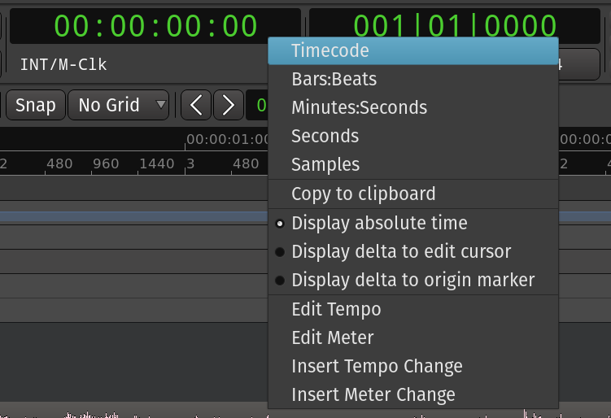

+++
title = "Setting up the timeline"
chapter = false
weight = 5
#pre = "<b>1. </b>"
+++

Because different users will want to use Ardour for different tasks, the
way time is measured in the application can be changed.

Users creating audio plays, documentaries, reportages or soundscapes may wish to use
**Minutes** and **Seconds**, for example, while those recording bands or
producing electronic music will most likely use **Bars** and **Beats**.
Video producers will find a frames-per-second **Timecode** handy, while
those wishing for extreme precision may even want to use **Samples**.
All of these can be viewed in Ardour and used as a means to organize
your regions and edits.

Primary and Secondary Clocks
----------------------------

There are two clocks near the top of the **Editor Window** which can
display the time in a number of formats: *Timecode*, *Bars:Beats*,
*Minutes:Seconds* and *Samples*. Right-click to change the format of
each of the two clocks.

These are called the transport clocks. The left one is the primary
transport clock and the right one is the secondary transport clock. The
advantage of having two transport clocks is that you see the playhead
position in two different time units without having to change any
settings.

To the right of these two clocks you see the "mini-timeline", also called "navigation timeline". Check the Ardour Manual for more informaion on [clocks](http://manual.ardour.org/ardours-interface/using-ardour-clock-displays/) and the [mini-timeline](https://manual.ardour.org/ardours-interface/mini-timeline/).

Snap Modes
----------

The **Snap Mode** menus are found just below the Clocks to the right.
They control the amount **Quantization** of the time grid, i.e., the
amount of "snap" an audio **Region** has to the type of grid you have
chosen.

When *No Grid* is selected, Regions may be moved freely around within
the Tracks. When *Grid* is selected, Regions will "snap" to the nearest
**Grid Point**. When *Magnetic* is selected, Regions can be moved freely
but will "snap" to a Grid Point when they are moved very close to one.

The middle **Units** menu is used to select what the Grid Points will
be, such as Beats, Bars, Marks, Minutes, Seconds, various aspects of the
SMPTE Timecode, or the edges of Regions. 

Timeline
--------

The **Timeline** is located below the Snap Mode menus, just above the
Main Canvas. By Right-Clicking on the Timeline labels (i.e., right-click on the left-side area where the words "Timecode, Bar:Beats, Meter" etc are displayed), you can set the check boxes to show or hide the different types of time information.

### Minutes/Seconds

To view Minutes and Seconds on the Timeline, right-click the Timeline labels
and select **Mins:Secs**.

### Bars/Beats

To view Bars and Beats on the Timeline, right-click the Timeline and
select **Bars & Beats**.

It is possible to set a **Meter** and **Tempo** for the entire Ardour
session, as well as to change them at different points in the same
session. For more information on this, please see the **Setting Up the
Meter** chapter.

### Timecode

To work with SMPTE video Timecode, first you need to set the **Timecode
fps** (Frames per Second). This can be found in the Timecode tab of the
Session Properties window (menu `Session > Properties` or the **Alt + O** 
shortcut)*.*

Once you have done that, make sure you make the Timecode ruler visible
by right-clicking in the Timeline and checking the *Timecode* box.

Continuing
----------

Now that you've set up the Timeline, continue on to the chapter on
creating tracks and busses to add one or more **Tracks** to your Session.

Next: [CREATING A TRACK OR BUS](../creating-a-track-or-bus)
