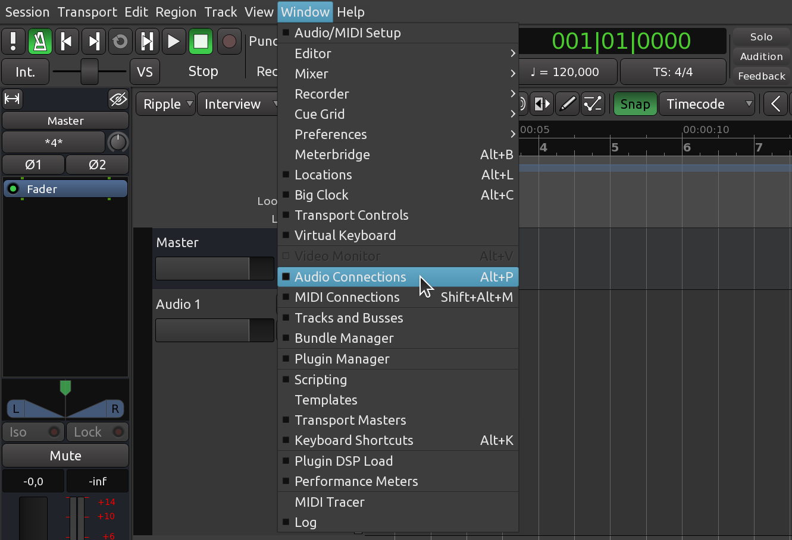
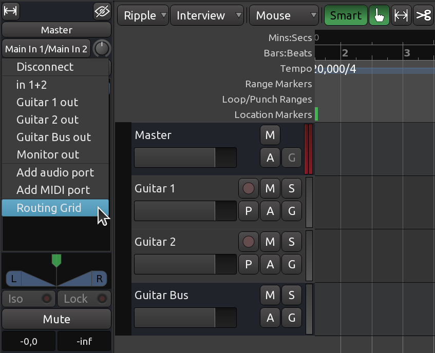
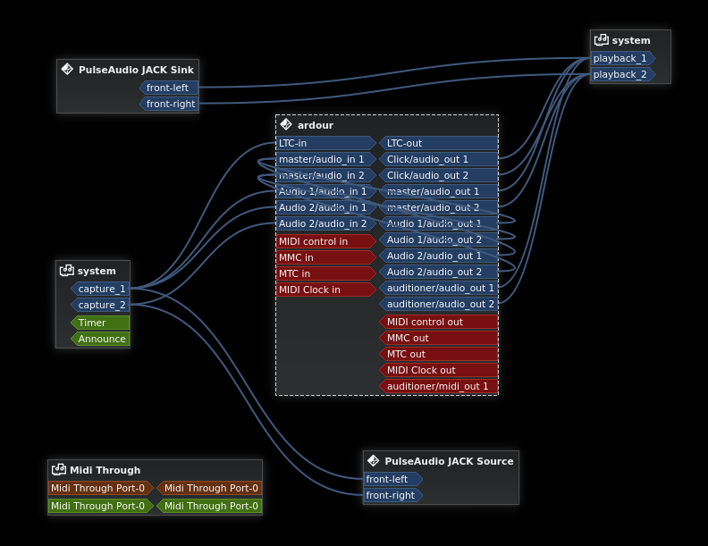

+++
title = "Understanding routing"
description = "Routing signal in Ardour"
chapter = false
weight = 2
#pre = "<b>1. </b>"
featherlight = false
+++

Routing an audio signal is sending it from somewhere to somewhere else.

In addition to getting audio signals to and from Ardour, routing plays an
important part inside Ardour itself. Examples of using routing inside Ardour
include routing audio from tracks to the _Master_ bus or to other busses,
creating 'sends', routing the outputs from busses to the _Master_ bus, etc. (see
chapter on **Creating a Track** for an explanation of tracks and busses). All
routing, both internal and external to Ardour, is handled by JACK.

### Routing in Ardour

The standard routing of inputs, tracks and busses in Ardour is determined when
a new session is created in the _Advanced Options_ of the _New Session_ dialog
box (see the [Starting Ardour](../../getting-started/starting-ardour-on-ubuntu/)
page). By default, the routing is as follows:

- The audio device inputs are routed to the track inputs.
- All outputs from tracks and busses are routed to the master bus inputs.
- The _Master_ bus outputs are routed to the audio device outputs.

Note that when a new bus is created, nothing is routed to its input.

This routing setup makes sense for sessions containing only tracks, but to make
use of any busses (other than the _Master_ bus) or to get creative with the
paths of the audio signals inside Ardour, we need to be able to change the
routing. 

The _Audio Connection Manager_ window (also known as the patchbay) is the main
way to make connections to, from ,and within Ardour's mixer. You can open this
window with the shortcut **Alt + P**, or through the
`Window > Audio Connections` menu.

 

The patchbay presents two groups of ports; one set of sources, and one of
destinations. Sources and destinations are organized by tabs. The available
sources are displayed vertically on the left side, and the destinations are
displayed horizontally at the bottom.

In the screenshot below, notice that the _Hardware_ tab is selected on the top
left (that's a source), and the *_Ardour Tracks_* is selected as a destination
in the bottom. This means that the matrix you see displays connections from
available hardware sound sources (for example, a microphone), into existing
Ardour tracks.  

 

The green dots represent a connection. The screenshot above tells us that
incoming sounds from "*system: capture\_1*" (the first input source of your
soundcard, or the built-in microphone of your laptop) are going into Ardour
track named "*Audio 1*", and also that incoming sounds from "*system:
capture\_1*" and "*system: capture\_2*" are respectively going into the Left and
Right inputs of Ardour track named "*Audio 2.*" 

Notice we can see that "*Audio 1*" is a Mono track because it only has one
connection slot, while track "*Audio 2*" is Stereo since it has two slots (Left
and Right).

The next screenshot shows the signal path from _Ardour Tracks_ (selected
vertical tab) into Ardour busses (selected horizontal tab). As mentioned
earlier, the default setting for all _Ardour Tracks_ is that their sound goes to
the _Master_ bus.

 

Note: remember that "*Audio 1*" is a Mono track? We saw it in the earlier
screenshot that "*Audio 1*" only has one input slot. But now on the screenshot
above you see that "Audio 1" has two outputs (Left and Right). This is normal:
we define whether a track is Mono or Stereo by its *number of inputs*, not
outputs. Mono tracks will hold a single channel of audio, but you can still
choose to place the sound on the left or the right speaker (or anywhere in
between). More on this in the chapter **Panning**.

Finally, let's explore a couple more tabs in the _Audio Connection Manager_ to
see the sound going from the _Master_ bus to the actual hardware outputs (your
loudspeakers or headphones):

 

As you can see, the selected source tab is now "*Ardour Busses*", and the
destination tab is _Hardware_. This session happens to have only one bus, the
default "master out". The green dots show that all sounds coming out of the
_Master_ bus are going to system playback 1 and 2, which are the outputs of your
soundcard. 

### How to connect and disconnect?

To make a connection, click on the desired empty square in the matrix; a green
dot will appear to indicate the connection is made.

To undo a connection, simply click on an existing green dot and it will
disappear.

### Practical example of routing to a bus 

In the following example session, there are two guitar tracks and one
unused bus called _Guitar_ bus, all Stereo.

 

Suppose you want to send the output from the two guitar tracks to the _Guitar_
bus instead of the _Master_ bus. This can be useful to control the volume of
both guitars with just one fader (in this case the _Guitar_ bus fader). Then the
output of the _Guitar_ bus, which is the sum of the two guitars, goes directly
to the _Master_ bus.

Here is how to edit the patchbay to get the desired routing. Select _Ardour
Tracks_ tab from _Sources_ (vertical tabs), and _Ardour Busses_ from
destinations (horizontal bottom tabs). Undo existing connections from both
tracks to _Master_. Then create connections from both tracks to _Guitar_ bus.
The final result would look like this: 

 

Now both guitar tracks are routed to the _Guitar_ bus, and no longer directly
connected to the _Master_ bus. We then make sure that the _Guitar_ bus is, by its
turn, routed to the _Master_ bus (the output routing of a bus is edited in the
same way as for a track), so that we can still hear the sound from both guitar
tracks. Now we can control the volume of both guitar tracks together by changing
the fader of the _Guitar_ bus. What's more, we can now add plugins to the Guitar
Bus to process the sound of both guitar Tracks together.

### Track- or Bus-specific views of the Patchbay

The _Audio Connection Manager_ (Patchbay) that you open with **Alt + P** shows you 
the complete matrix of every single source and every single destination
available in Ardour. Sometimes this is too much: you just want to quickly change 
the routing of a single track input or output, for example. Ardour allows you to 
access a relevant subset of Patchbay connections when you click directly on the 
**Inputs** or **Outputs** button of a track or bus in the mixer strip.

The **Inputs** button is at the top, and the **Outputs** button is on the bottom
of the  strip. Clicking on either one will show you a menu of connection
options. In the  screenshot below, for example, you would click on the **1/2**
button right under the track name "Guitar 1" in order to access this menu:

You may select a connection right there from the menu, or choose _Routing Grid_ 
to see a simpler version of the _Audio Connection Manager_ with only the
**Inputs** or **Outputs** of the selected track or bus. 

### All Ardour connections are JACK connections

It is important to realize that any routings that you make or disconnect from
within Ardour are in fact JACK routings, which you can see from other
applications like _Qjackctl_ or _Catia_, depending on your operating system.
Below is an example of a _Catia_ window (Linux only) displaying the same JACK
connections discussed above:

 

Continuing
----------

In this chapter, we covered how to manage routing inside Ardour, or between
Ardour and the sound card. However, one of the strengths of using the JACK
system is that it can also manage connections between applications on the same
computer. To gain a better understanding of how this works, please continue to
the chapter _Routing Between Applications_. If you would prefer to work only
with Ardour, then skip ahead to the section on _Arranging Tracks_.

NEXT: [ROUTING BETWEEN APPLICATIONS](../routing-between-applications) or 
[ARRANGING TRACKS](../arranging-tracks)
