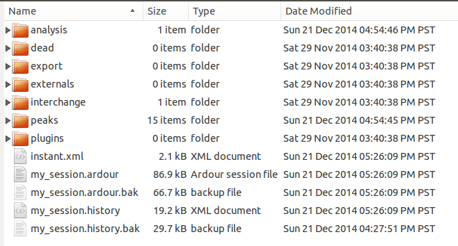

+++
title = "Saving a session"
chapter = false
weight = 1
+++

There are a number of ways to save Sessions in Ardour, so that each session
can be use later on. The simplest way is to save the entire session just like
you would save other documents: hitting **Ctrl+S**.

A new session is first saved at the moment you create it. While you are working
on it, you should save it frequently. Get into the habit of hitting **Ctrl+S**
(or **Command+S** on a Mac) every few minutes.

{}
Avoid using any characters other than letters and numbers when naming your
session. Avoid white spaces, accented letters, !@#$%\*()+, periods, commas, etc.
Use dashes or underscores if you like. For example, instead of "My Great
Session!", prefer "My_Great_Session", or "MyGreatSession", or
"my-great-session". Instead of "Açaí", write "Acai" (without accented letters),
etc. Once you have created your Ardour session, do _not_ manually rename any
folders or files that belong to the session.
{}

## Ardour File and Folder Format

The contents of a typical session's folder on your hard drive might look
something like this:

A bit of information about some of the components inside that folder:

* The name of this session is _my\_session_.
* The main session file is called `my_session.ardour`. The session file is
periodically backed up by Ardour with a `.bak` extension.
* The `.history` file keeps a record of changes you have made during your
session, and is also periodically backed up.
* The `interchange` folder contains the actual audio data of all the regions
used in your session.
* The `export` folder is where exported files are saved by default.

{}
If double-clicking on the session file does not launch Ardour, use the standard
method of first opening the application itself, then choosing a session from the
_Session Setup_ dialog.
{}

## Moving a session to another computer or disk

If you need to move your Ardour session to another computer, or if you would
like to make a backup of it on an external drive, *you must copy the entire
folder* containing all of the files mentioned above. It is _not_ enough to copy
just the `*.ardour` file.

The convenient way to do so is to use `Session > Archive...` command. A single
ZIP file with all data will be created. Please note that this will drop
snapshots, only the current state will be saved.

{}
When copying an Ardour folder to another computer or drive, do not manually
change its name or the name of any of the internal files.
{}

## Continuing

Saving an entire allows you to open it again at a later time. However, if you
would like to preserve a certain state that your is in, to be able to return to
that state later on after you have made changes, then please continue to the
next session called _Saving  a Snapshot_. 

Next: [SAVING A SNAPSHOT](../saving-a-snapshot)
